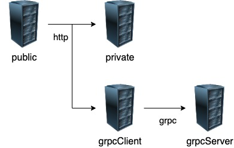
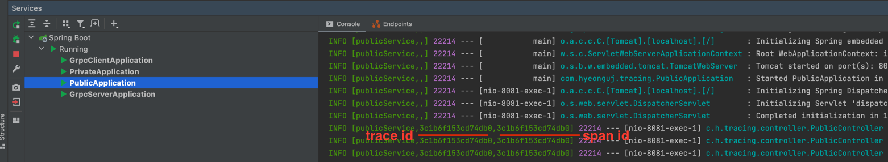
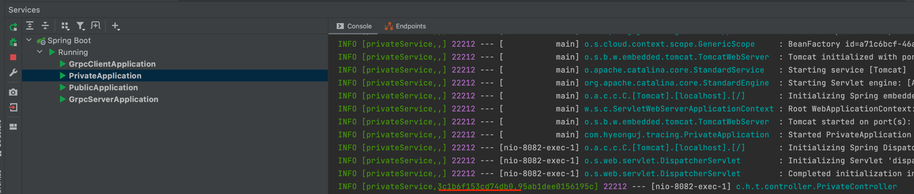
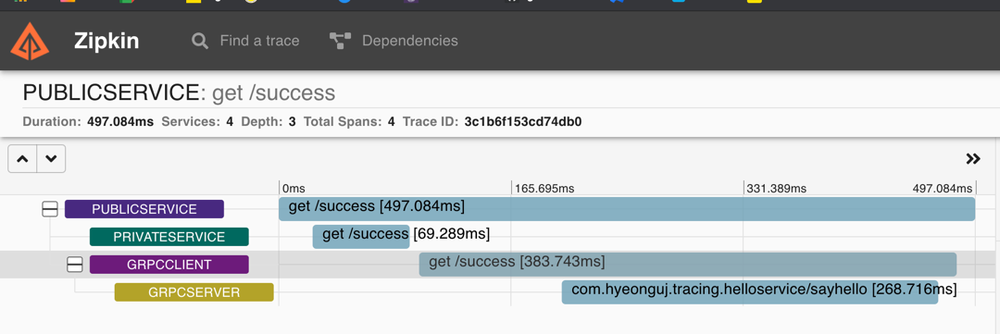
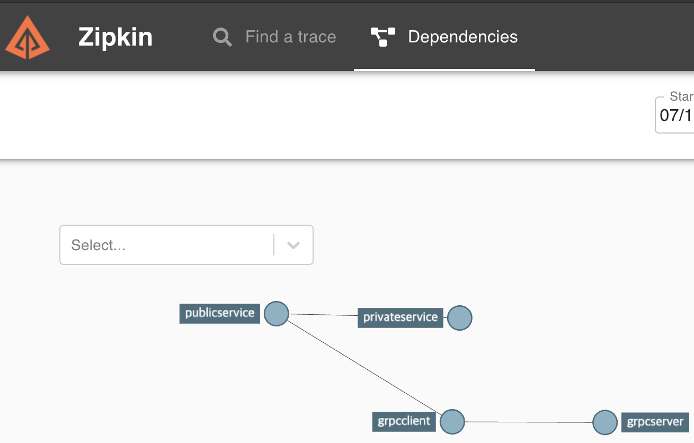
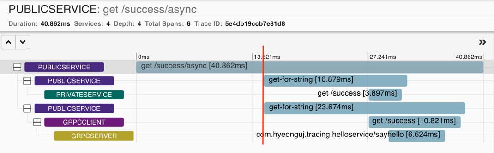
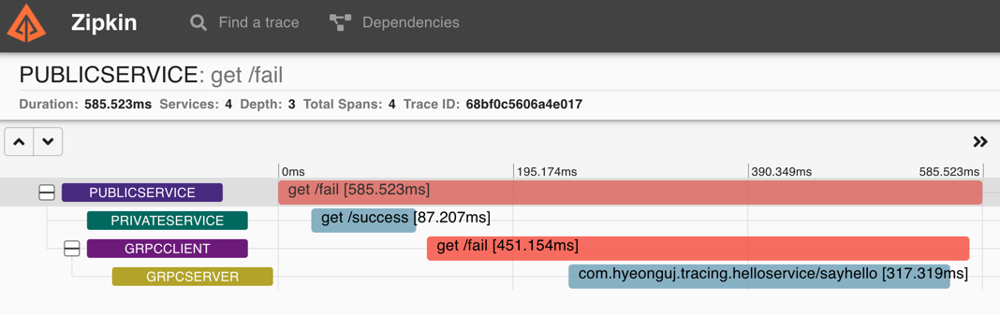

# spring-boot-sleuth-zipkin-grpc-sample



- public : 외부 클라이언트들이 접근 (app, web, ...) (8081 port)
- private : public 서비스에서만 접근가능. http 통신 (8082 port)
- grpcClient : 8083 port로 http 요청을 받는다. grpcServer와 통신하기위해 grpc 호출부를 구현하고있다
- grpcServer : grpc로 인터페이스를 제공하고 8084 포트를 가진다. http통신을 사용하지 않는다.


# how to run
1. run zipkin with docker (install docker)

```sh
docker run -d -p 9411:9411 openzipkin/zipkin
```

2. generate proto for grpc (grpcClient, grpcServer)

```sh
./gradlew :grpcClient:generateProto :grpcServer:generateProto  
```

3. run services

IDE 를 통해 각각 실행해도 무관.

```sh
./gradlew :publicService:bootrun 
./gradlew :privateService:bootrun 
./gradlew :grpcClient:bootrun 
./gradlew :grpcServer:bootrun 
```

# how to test

## example (sync, blocking)  
```sh
curl http://localhost:8081/success
```

- see logs




- http://localhost:9411/zipkin/traces/{traceId}

  
- also you can see dependencies
  
  

## example2 (async, blocking)

```sh
curl http://localhost:8081/success/async
```


## example3 - error
grpcClient에서 고의적으로 HttpStatus 500 으로 응답 
오류가 난 부분은 붉게 표시됨을 확인 할 수 있다.

```sh
curl http://localhost:8081/fail
```

